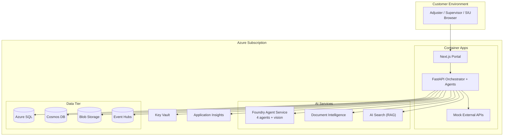

# Agentic Claims Processing PoC (v2)

> **Industry:** Financial Services — Property & Casualty Insurance
> **Pattern:** Event-driven multi-agent claims pipeline on Microsoft Foundry Agent Service
> **Datasources:** Azure SQL + Cosmos DB + Blob Storage + Event Hubs + AI Search + 6 mock external APIs
> **AI:** GPT-4o (text + vision), Document Intelligence, AI Search RAG, link-graph fraud detection
> **Deploy:** `azd up` into the customer's own Azure subscription

This repository implements an agentic claims-processing PoC. A Next.js adjuster portal sits on top of a FastAPI orchestrator that drives four Foundry agents (FNOL/Doc, Triage/Coverage, Assessment/Settlement, Responsible-AI Guardrails). The system spans six Azure datastores and integrates with six mock external APIs to demonstrate a production-shaped architecture.

## Architecture



## Quick Start

Prerequisites:
- Azure subscription with quota for: SQL Serverless, Container Apps, Cosmos serverless, AI Search Basic, Document Intelligence S0, Event Hubs Standard, Foundry (gpt-4o + gpt-4o-mini + text-embedding-3-large)
- [Azure Developer CLI (`azd`)](https://learn.microsoft.com/azure/developer/azure-developer-cli/install-azd) and Docker
- Owner or Contributor + User Access Administrator on the subscription

```bash
# 1. Clone
git clone https://github.com/dustinsawicki/ProjectTriad.git
cd ProjectTriad

# 2. Login and create environment
azd auth login
azd env new claims-poc-dev

# 3. Configure
azd env set AZURE_SUBSCRIPTION_ID  <your-subscription-id>
azd env set AZURE_LOCATION         swedencentral
azd env set AZURE_TENANT_ID        <your-tenant-id>
azd env set AZURE_OPENAI_MODEL     gpt-4o
azd env set ADJUSTER_USER_OBJECT_IDS "<entra-object-id-1>,<entra-object-id-2>"

# 4. Deploy (~20 min: infra + containers + seed all datastores)
azd up
```

After deployment, the portal URL is printed. Sign in with one of your configured Entra users.

## Demo Claims (CLM-200001..CLM-200010)

| Claim # | Loss type | Demo intent |
|---------|-----------|-------------|
| CLM-200001 | Auto collision (single) | Happy path — all sources lit |
| CLM-200002 | Home water damage | PDF + photo citations |
| CLM-200003 | Auto, telematics-led | Telematics as primary evidence |
| CLM-200004 | Auto, inflated estimate | Guardrail block via AVM mismatch |
| CLM-200005 | Auto, 3rd-party at fault | Subrogation + recovery |
| CLM-200006 | Bodily injury | Medical bill review |
| CLM-200007 | Home liability | Liability + cross-product |
| CLM-200008 | Auto, fraud ring | Link analysis + ISO lookup |
| CLM-200009 | Auto, fraud ring | Same ring as 200008 |
| CLM-200010 | Auto, fraud ring | Full 3-node SIU graph |

## Key UI Surfaces

- **Adjuster Portal** (`/claims`) — Claim workspace with evidence, agent decisions, weather/telematics chips
- **SIU Link Graph** (`/siu/graph?claim=CLM-200008`) — Force-directed fraud ring visualization
- **Supervisor Dashboard** (`/supervisor`) — Live event log, App Insights workbook, telematics replay

## Reseed and Teardown

```bash
# Re-run all data generators (idempotent — truncates then re-inserts)
azd hooks run reseed

# Tear everything down
azd down --purge
```

## Azure Services

| Service | Purpose |
|---------|---------|
| Azure Container Apps (×3) | Web + API + External APIs |
| Azure SQL Database | Canonical claim/policy state |
| Cosmos DB (serverless) | Telematics, feature store, link graph |
| Blob Storage | Photos, PDFs, telematics-raw, historical corpus |
| Event Hubs (Standard) | Claim lifecycle events, fraud scoring, telematics stream |
| AI Search (Basic) | RAG over historical claims + policy endorsements |
| Document Intelligence (S0) | PDF extraction (police reports, estimates, medical bills) |
| Foundry Agent Service | 4 agents (gpt-4o with vision + gpt-4o-mini) |
| Key Vault | Secrets |
| Application Insights | Distributed tracing across all services |

## Repository Layout

```
infra/                    Bicep + data generators
  main.bicep              Subscription-scope entry point
  modules/                Per-service Bicep modules (10 modules)
  data/                   seed_all.py + 10 generators
  sql/                    schema.sql (v1 compat)
src/api/                  Python 3.12 FastAPI + Foundry agents
  app/clients/            Azure service clients (Cosmos, Blob, EH, Search, DI)
  app/consumers/          Event Hub consumer dispatcher
  app/tools/              Agent tools (vision, RAG, link-graph, externals)
  app/routers/            REST endpoints (claims, events, siu, supervisor)
  app/services/           Event-driven orchestrator
src/web/                  Next.js 14 (App Router) + Tailwind + MSAL
  app/siu/graph/          SIU link-graph visualization
  app/supervisor/         Dashboard + workbook embed
  components/Graph.tsx    vis-network wrapper
src/external-apis/        FastAPI mock service (ISO, weather, police, AVM, medbill, payment)
azure.yaml                azd service map (3 services)
```

## Production Hardening Roadmap

1. VNet + Private Endpoints for all services
2. Defender for SQL, Containers
3. Customer-Managed Keys
4. Azure Front Door + WAF
5. Per-environment isolation (dev/test/prod)
6. Replace mock external APIs with real connectors
