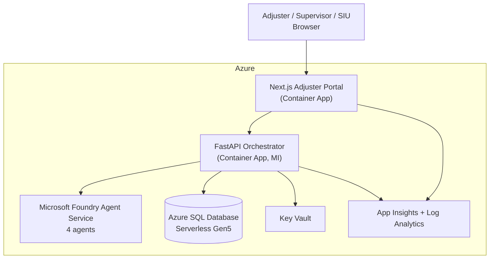

# Agentic Claims Processing PoC

> **Industry:** Financial Services — Property & Casualty Insurance
> **Pattern:** Four-agent claims pipeline on Microsoft Foundry Agent Service
> **Sole datasource:** Azure SQL Database (synthetic P&C dataset seeded at deploy)
> **Deploy:** `azd up` into the customer's own Azure subscription

This repository implements the [Functional Specification](../../../Scratchpad/contoso-insurance-poc-spec.md) for an agentic claims-processing PoC. A Next.js adjuster portal sits on top of a FastAPI orchestrator that drives four Foundry agents (FNOL/Doc, Triage/Coverage, Assessment/Settlement, Responsible-AI Guardrails) reading and writing a single Azure SQL Database.

## Architecture



## Quick Start for the Customer

You will deploy this into your own Azure subscription. You need:

- An Azure subscription with quota for Azure SQL (Serverless GP), Azure Container Apps, and an Azure AI Foundry project with `gpt-4o` deployment.
- The [Azure Developer CLI (`azd`)](https://learn.microsoft.com/azure/developer/azure-developer-cli/install-azd) and Docker.
- Owner or Contributor + User Access Administrator on the target subscription (for the deploy-time role assignments).

```bash
# 1. Clone
git clone https://github.com/<microsoft-org>/<repo>.git
cd <repo>

# 2. Initialize an azd environment for your tenant/subscription
azd auth login
azd env new claims-poc-dev

# 3. Tell azd which subscription, region, and Entra IDs to wire up
azd env set AZURE_SUBSCRIPTION_ID  <your-subscription-id>
azd env set AZURE_LOCATION         eastus2
azd env set AZURE_TENANT_ID        <your-tenant-id>
azd env set AZURE_OPENAI_MODEL     gpt-4o
azd env set ADJUSTER_USER_OBJECT_IDS "<entra-object-id-1>,<entra-object-id-2>"

# 4. Deploy infra, build & deploy containers, seed synthetic data
azd up
```

After `azd up` finishes it will print the portal URL. Sign in with one of the Entra users you added above.

## Demo script

Five seeded claims walk through the pipeline:

| Claim # | Loss type | Expected route | What to highlight |
|---------|-----------|----------------|-------------------|
| CLM-100001 | Auto collision, single vehicle | STP | Full happy-path: FNOL → coverage → settlement → guardrail pass → adjuster approve |
| CLM-100002 | Home water damage | Desk | Coverage agent cites policy endorsement; subrogation flag false |
| CLM-100003 | Auto, suspected fraud ring | SIU | Fraud signal cites shared address + phone with 2 prior claims |
| CLM-100004 | Auto, inflated estimate | Desk + Guardrail block | Assessment proposes settlement, Guardrails blocks vs. coverage limit |
| CLM-100005 | Auto, third-party at fault | Desk | Subrogation flag true; estimate + recovery memo |

## Reseed and Teardown

```bash
# Re-run the seed (idempotent — truncates then re-inserts)
azd hooks run reseed

# Tear everything down
azd down --purge
```

## Production hardening roadmap

This PoC is deliberately public-ingress and single-region for fast deployment. Hardening path (each drops in as additional Bicep modules):

1. VNet + Private Endpoints for SQL, Key Vault, ACR, Foundry
2. Defender for SQL, Defender for Containers
3. Customer-Managed Keys on SQL and Key Vault
4. Azure Front Door + WAF in front of Container Apps
5. Per-environment isolation (dev/test/prod) with separate Bicep parameter files

## Repository layout

```
infra/                    Bicep + SQL schema + Python seed
  main.bicep              Subscription-scope entry point
  modules/                Per-service Bicep modules
  sql/                    schema.sql + seed.py
src/api/                  Python 3.12 FastAPI + Foundry agents
  app/agents/             Foundry agent JSON definitions
  app/tools/              Typed Python tools the agents invoke
  app/repositories/       SQL access (the only layer that touches SQL)
  app/routers/            REST endpoints
  app/services/           Orchestrator state machine
src/web/                  Next.js 14 (App Router) + Tailwind + MSAL
.github/workflows/        GitHub Actions: lint, test, azd up via OIDC
azure.yaml                azd service map
```

## Status

PoC scaffold — ready for `azd up` and demo. See the full spec for in-scope/out-of-scope, NFRs, and risks: [`Scratchpad/contoso-insurance-poc-spec.md`](../../../Scratchpad/contoso-insurance-poc-spec.md).
